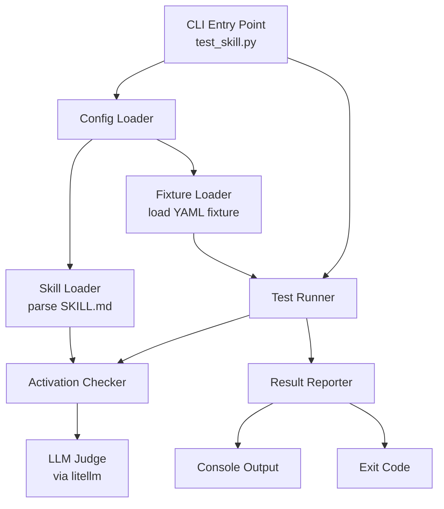
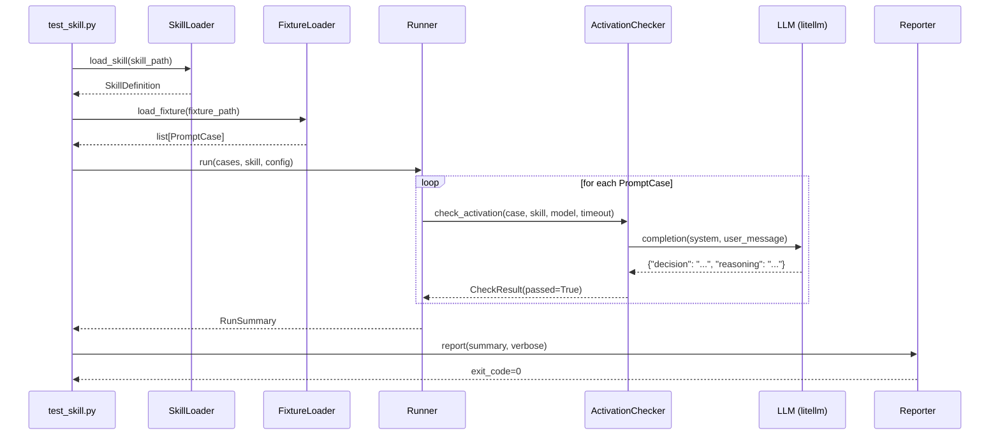
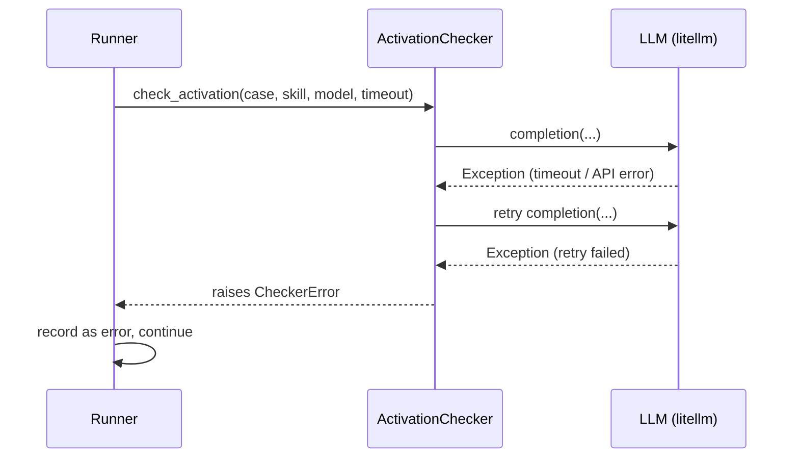

# Design Document: Skill Test Harness

## Overview

A lightweight Python test harness that validates whether an agent skill activates correctly for a curated set of labeled prompts. Given a skill file (SKILL.md) and a fixture file containing prompts tagged as "should activate" or "should not activate", the harness runs each prompt through an activation-check mechanism, reports pass/fail results per prompt, and exits with a non-zero status code on any failure.

The harness is designed to work with any skill that follows the standard skill file format — it is not coupled to the `springboot-openapi-generator` skill. Configuration is provided via CLI arguments and/or an optional config file, making it easy to point at different skills and fixture sets.

## Architecture



The harness is intentionally thin: it has no web server, no daemon process, and no persistent state. Each run is a one-shot execution that loads config, runs checks, and reports.

## Components and Interfaces

### Component 1: Config Loader (`config.py`)

**Purpose**: Resolve all runtime configuration from CLI args, environment variables, and an optional `harness.yaml` config file. Later sources override earlier ones in the priority order: config file < environment variables < CLI args.

**Interface**:
```python
from dataclasses import dataclass

@dataclass
class HarnessConfig:
    skill_path: str          # Path to SKILL.md
    fixture_path: str        # Path to prompts fixture file
    model: str               # LLM model identifier, e.g. "claude-3-5-haiku-20241022"
    timeout_seconds: int     # Per-prompt LLM call timeout
    verbose: bool            # Print per-prompt detail
```

**Responsibilities**:
- Parse CLI arguments (`--skill`, `--fixture`, `--model`, `--timeout`, `--verbose`)
- Fall back to `SKILL_HARNESS_MODEL` environment variable for model selection
- Fall back to a `harness.yaml` config file in the current working directory
- Validate that `skill_path` and `fixture_path` exist and are readable
- Raise `ConfigError` with a descriptive message for any missing or invalid config

---

### Component 2: Skill Loader (`skill_loader.py`)

**Purpose**: Parse a SKILL.md file and extract the fields the activation checker needs.

**Interface**:
```python
@dataclass
class SkillDefinition:
    name: str
    description: str
    when_to_use: str        # Full text of the "## When to Use" section
    raw_content: str        # Full markdown content for context

def load_skill(path: str) -> SkillDefinition: ...
```

**Responsibilities**:
- Read the SKILL.md file
- Extract the YAML front matter `description` field
- Extract the `## When to Use` section body
- Raise `SkillLoadError` if the file is missing required sections

---

### Component 3: Fixture Loader (`fixture_loader.py`)

**Purpose**: Load and validate the YAML prompt fixture file.

**Interface**:
```python
from enum import Enum

class ExpectedOutcome(Enum):
    ACTIVATE = "activate"
    NO_ACTIVATE = "no_activate"

@dataclass
class PromptCase:
    id: str                         # Unique identifier for the test case
    prompt: str                     # The user prompt text
    expected: ExpectedOutcome       # Expected activation outcome
    notes: str | None               # Optional human-readable notes

def load_fixture(path: str) -> list[PromptCase]: ...
```

**YAML fixture format**:
```yaml
# test/fixtures/springboot-openapi-generator.yaml
skill: springboot-openapi-generator   # informational only

cases:
  - id: create-rest-api
    prompt: "Create a Spring Boot REST microservice from this OpenAPI spec"
    expected: activate
    notes: "Core use case"

  - id: add-openapi-client
    prompt: "Generate an HTTP client for a downstream service using the OpenAPI spec"
    expected: activate

  - id: plain-java-question
    prompt: "How do I write a for loop in Java?"
    expected: no_activate
    notes: "Generic Java question, not microservice scaffolding"

  - id: python-api
    prompt: "Build me a REST API in Python using FastAPI"
    expected: no_activate
    notes: "Different language and framework"
```

**Responsibilities**:
- Parse YAML file
- Validate required fields (`id`, `prompt`, `expected`)
- Validate `expected` is one of the allowed values
- Raise `FixtureLoadError` with line-level detail for any schema violation
- Detect and reject duplicate `id` values

---

### Component 4: Activation Checker (`activation_checker.py`)

**Purpose**: Determine whether a given prompt would activate a given skill. Uses an LLM judge via `litellm` to evaluate the match between the prompt and the skill's `description` + `when_to_use` fields.

**Interface**:
```python
from enum import Enum

class ActivationResult(Enum):
    ACTIVATE = "activate"
    NO_ACTIVATE = "no_activate"

@dataclass
class CheckResult:
    prompt_id: str
    prompt: str
    expected: ExpectedOutcome
    actual: ActivationResult
    passed: bool
    reasoning: str          # LLM explanation (for verbose output)
    latency_ms: int

def check_activation(
    prompt_case: PromptCase,
    skill: SkillDefinition,
    model: str,
    timeout_seconds: int,
) -> CheckResult: ...
```

**LLM Judge Prompt Design**:

The checker sends a single structured prompt to the LLM. The system prompt establishes the judge role; the user message contains the skill definition and the test prompt. The LLM is asked to respond with a JSON object `{"decision": "activate" | "no_activate", "reasoning": "..."}`.

```python
SYSTEM_PROMPT = """You are an AI agent skill router. Your job is to decide whether a given user prompt should activate a specific agent skill.

You will be given:
1. A skill definition (name, description, and "when to use" guidance)
2. A user prompt

Respond with a JSON object with exactly two fields:
- "decision": either "activate" or "no_activate"
- "reasoning": a brief explanation (1-2 sentences)

Do not include any other text outside the JSON object."""

USER_TEMPLATE = """## Skill Definition

**Name**: {name}

**Description**: {description}

**When to Use**:
{when_to_use}

## User Prompt

{prompt}

Should this skill activate for the above prompt?"""
```

**Responsibilities**:
- Format and send the judge prompt via `litellm.completion()`
- Parse the JSON response; retry once on malformed JSON
- Record latency
- Map LLM decision to `ActivationResult`
- Raise `CheckerError` on API failure after exhausting retries
- Never hard-code an API key — rely on environment variables (`ANTHROPIC_API_KEY`, `OPENAI_API_KEY`, etc.) as consumed by `litellm`

---

### Component 5: Test Runner (`runner.py`)

**Purpose**: Orchestrate the execution of all prompt cases and collect results.

**Interface**:
```python
@dataclass
class RunSummary:
    total: int
    passed: int
    failed: int
    errors: int
    results: list[CheckResult]
    duration_ms: int

def run(
    cases: list[PromptCase],
    skill: SkillDefinition,
    config: HarnessConfig,
) -> RunSummary: ...
```

**Responsibilities**:
- Iterate over all `PromptCase` items sequentially (no parallelism to avoid rate limits)
- Call `check_activation()` for each case
- Catch `CheckerError` per case and record as an error (not a failure) without aborting the run
- Collect all results into `RunSummary`

---

### Component 6: Result Reporter (`reporter.py`)

**Purpose**: Format and output test results to stdout, and determine the process exit code.

**Interface**:
```python
def report(summary: RunSummary, verbose: bool) -> int:
    """Print results and return exit code (0 = all passed, 1 = failures/errors)."""
    ...
```

**Default output format** (always shown):
```
Running skill activation tests...

  ✓ create-rest-api           [activate → activate]
  ✗ add-openapi-client        [activate → no_activate]   FAIL
  ✓ plain-java-question       [no_activate → no_activate]
  ! python-api                [no_activate → ERROR: timeout]

Results: 2 passed, 1 failed, 1 error  (4 total)
```

**Verbose output** (`--verbose`): also prints the LLM's reasoning for each case.

**Exit code**:
- `0` — all cases passed
- `1` — one or more cases failed or errored

---

### Component 7: CLI Entry Point (`test_skill.py`)

**Purpose**: Main entry point that wires all components together.

```python
# test/test_skill.py
def main() -> None:
    config = load_config()          # parse CLI + env + config file
    skill = load_skill(config.skill_path)
    cases = load_fixture(config.fixture_path)
    summary = run(cases, skill, config)
    exit_code = report(summary, config.verbose)
    sys.exit(exit_code)
```

---

## Data Models

### HarnessConfig

```python
@dataclass
class HarnessConfig:
    skill_path: str
    fixture_path: str
    model: str = "claude-3-5-haiku-20241022"
    timeout_seconds: int = 30
    verbose: bool = False
```

**Validation Rules**:
- `skill_path` must point to an existing readable file
- `fixture_path` must point to an existing readable file
- `model` must be a non-empty string
- `timeout_seconds` must be between 1 and 300

### PromptCase

```python
@dataclass
class PromptCase:
    id: str
    prompt: str
    expected: ExpectedOutcome
    notes: str | None = None
```

**Validation Rules**:
- `id` must be a non-empty string matching `^[a-zA-Z0-9_-]+$`
- `prompt` must be a non-empty string
- `expected` must be a valid `ExpectedOutcome` value
- `id` values must be unique within a fixture file

### CheckResult

```python
@dataclass
class CheckResult:
    prompt_id: str
    prompt: str
    expected: ExpectedOutcome
    actual: ActivationResult | None     # None if an error occurred
    passed: bool
    reasoning: str
    latency_ms: int
    error: str | None = None            # Set if an exception was caught
```

---

## Key Functions with Formal Specifications

### `load_skill(path: str) -> SkillDefinition`

**Preconditions**:
- `path` is a non-empty string
- The file at `path` exists and is readable

**Postconditions**:
- Returns a `SkillDefinition` with non-empty `description` and `when_to_use`
- Raises `SkillLoadError` if any required section is absent

### `load_fixture(path: str) -> list[PromptCase]`

**Preconditions**:
- `path` is a non-empty string
- The file at `path` is valid YAML

**Postconditions**:
- Returns a list with at least one `PromptCase`
- Every `PromptCase.id` is unique within the returned list
- Every `PromptCase.expected` is a valid `ExpectedOutcome`
- Raises `FixtureLoadError` for any schema or uniqueness violation

**Loop Invariants** (validation loop over cases):
- All previously validated cases satisfy the schema and have unique IDs

### `check_activation(prompt_case, skill, model, timeout_seconds) -> CheckResult`

**Preconditions**:
- `prompt_case.prompt` is non-empty
- `skill.description` and `skill.when_to_use` are non-empty
- `model` is a valid litellm model identifier
- Relevant API key environment variable is set

**Postconditions**:
- Returns a `CheckResult` where `passed = (actual == expected)`
- `reasoning` is a non-empty string
- `latency_ms` is non-negative
- Raises `CheckerError` if the LLM call fails after retry

### `run(cases, skill, config) -> RunSummary`

**Preconditions**:
- `cases` is non-empty
- `skill` is fully loaded
- `config` is valid

**Postconditions**:
- `summary.total == len(cases)`
- `summary.passed + summary.failed + summary.errors == summary.total`
- `summary.duration_ms >= 0`

**Loop Invariants**:
- After processing N cases: `passed_so_far + failed_so_far + errors_so_far == N`

---

## Sequence Diagrams

### Happy Path: All Prompts Pass



### Error Path: LLM Call Fails



---

## Error Handling

### Config Errors

**Condition**: Missing or invalid CLI args / config file  
**Response**: Print descriptive message to stderr, exit with code 2  
**Recovery**: User corrects args and reruns

### Skill Load Errors

**Condition**: SKILL.md missing, unreadable, or missing required sections  
**Response**: Print `SkillLoadError` message, abort run, exit code 2  
**Recovery**: User provides a valid skill path

### Fixture Load Errors

**Condition**: YAML parse error, schema violation, duplicate IDs  
**Response**: Print `FixtureLoadError` with file and line context, abort run, exit code 2  
**Recovery**: User fixes the fixture file

### Per-Prompt LLM Errors

**Condition**: LLM API call fails (timeout, rate limit, auth error)  
**Response**: Record the case as `error` in results, continue with remaining cases  
**Recovery**: Errors are reported in summary; user can rerun or adjust timeout/model

### Malformed LLM Response

**Condition**: LLM returns non-JSON or JSON missing required fields  
**Response**: Retry once; if still malformed, record as `error`  
**Recovery**: Retry on next run or switch model

---

## Testing Strategy

### Unit Testing Approach

Use `pytest` as the test framework. Each module has a corresponding test file under `test/tests/`.

Key unit test areas:
- `skill_loader`: correct parsing, missing sections, malformed front matter
- `fixture_loader`: valid YAML, duplicate IDs, bad `expected` values, missing required fields
- `config`: precedence order (config file < env < CLI), invalid paths, defaults
- `reporter`: output format correctness, exit code logic
- `runner`: error isolation (one failed LLM call does not abort the run), summary arithmetic

### Property-Based Testing Approach

**Property Test Library**: `hypothesis`

Property tests focus on the data parsing and result-aggregation layers, which have clear universally-quantifiable invariants.

### Integration Testing Approach

Integration tests use a real (or recorded) LLM call to verify the full pipeline end-to-end. These are opt-in and guarded by an environment variable (`SKILL_HARNESS_INTEGRATION_TESTS=1`) so they don't run in CI without an API key.

---

## Performance Considerations

- LLM calls are sequential to avoid rate-limit errors; typical wall-clock time is `N × 1–3s` for small fixture sets (< 50 prompts)
- `timeout_seconds` defaults to 30 and can be tuned per run
- No caching in v1; response caching can be added later if fixture sets grow large

---

## Security Considerations

- API keys are read exclusively from environment variables — never from the fixture or config file
- The config file (`harness.yaml`) is never executed; it is parsed as YAML with safe loader
- Prompt content from fixture files is passed to an external LLM; no sanitization is needed since the harness is a developer tool, not a user-facing service

---

## Dependencies

| Package | Purpose | Minimum Version |
|---------|---------|-----------------|
| `litellm` | Unified LLM API client (supports Anthropic, OpenAI, etc.) | 1.40+ |
| `pyyaml` | YAML fixture and config file parsing | 6.0+ |
| `pytest` | Unit test runner | 8.0+ |
| `hypothesis` | Property-based test library | 6.100+ |

Python version requirement: **3.11+** (uses `dataclasses`, `match` statement, `str | None` union syntax).

---

## Correctness Properties

*A property is a characteristic or behavior that should hold true across all valid executions of a system — essentially, a formal statement about what the system should do. Properties serve as the bridge between human-readable specifications and machine-verifiable correctness guarantees.*

### Property 1: Config precedence — CLI overrides file

For any configuration key that appears in both `harness.yaml` and as a CLI argument, the CLI argument value SHALL always be the resolved value in the returned `HarnessConfig`, regardless of what the file specifies.

**Validates: Requirements 1.8**

---

### Property 2: Timeout validation accepts valid range, rejects invalid range

For any integer N, `validate_timeout(N)` SHALL succeed (not raise) if and only if `1 <= N <= 300`. For all integers outside that range, it SHALL raise `ConfigError`.

**Validates: Requirements 1.11**

---

### Property 3: Skill fields are correctly extracted

For any SKILL.md file containing a non-empty `description` in its YAML front matter and a non-empty `## When to Use` section, `load_skill()` SHALL return a `SkillDefinition` whose `description` field exactly matches the front-matter value and whose `when_to_use` field exactly matches the section body, and whose `raw_content` field equals the full file content verbatim.

**Validates: Requirements 2.2, 2.3, 2.6**

---

### Property 4: All loaded PromptCases satisfy the schema

For any fixture file that loads without error, every `PromptCase` in the returned list SHALL have a non-empty `id` matching `^[a-zA-Z0-9_-]+$`, a non-empty `prompt` string, and an `expected` value that is a valid `ExpectedOutcome`.

**Validates: Requirements 3.2, 3.3, 3.4**

---

### Property 5: Fixture loading rejects duplicate IDs

For any fixture file containing two or more cases that share the same `id` value, `load_fixture()` SHALL raise a `FixtureLoadError` identifying the duplicate.

**Validates: Requirements 3.6**

---

### Property 6: Fixture loading rejects invalid or missing required fields

For any fixture case that is missing any of `id`, `prompt`, or `expected`, or whose `expected` field is not `"activate"` or `"no_activate"`, `load_fixture()` SHALL raise a `FixtureLoadError`.

**Validates: Requirements 3.7, 3.8**

---

### Property 7: LLM response is correctly mapped to CheckResult

For any mocked LLM response JSON containing a `"decision"` field (`"activate"` or `"no_activate"`) and a `"reasoning"` field, `check_activation()` SHALL return a `CheckResult` where `actual` matches the decision, `reasoning` matches the response field, and `latency_ms` is a non-negative integer.

**Validates: Requirements 4.2, 4.3, 4.4**

---

### Property 8: CheckResult.passed is determined solely by actual vs expected

For all four combinations of `actual ∈ {activate, no_activate}` and `expected ∈ {activate, no_activate}`, `CheckResult.passed` SHALL be `True` if and only if `actual == expected`.

**Validates: Requirements 4.9**

---

### Property 9: LLM judge prompt contains all skill and prompt fields

For any `SkillDefinition` and any `PromptCase`, the user message sent to the LLM by `check_activation()` SHALL contain the skill's `name`, `description`, `when_to_use` text, and the prompt case's `prompt` string.

**Validates: Requirements 4.1, 7.2**

---

### Property 10: Runner processes every case and counts are consistent

For any list of N `PromptCase` items, `run()` SHALL return a `RunSummary` where `total == N` and `passed + failed + errors == total`, regardless of which individual cases pass, fail, or raise `CheckerError`.

**Validates: Requirements 5.1, 5.3, 5.4**

---

### Property 11: Runner error isolation — a single failing case does not abort the run

For any list of prompt cases where one or more cases raise `CheckerError`, the runner SHALL still produce results for all remaining cases; no case that did not raise an error SHALL be absent from the `RunSummary.results`.

**Validates: Requirements 5.2**

---

### Property 12: Reporter output contains a line for every result

For any `RunSummary` containing N `CheckResult` items, `report()` SHALL produce output that includes exactly N result lines, one per case, each containing the case ID.

**Validates: Requirements 6.1**

---

### Property 13: Reporter output contains correct counts in summary line

For any `RunSummary`, `report()` SHALL produce output containing the numeric values of `total`, `passed`, `failed`, and `errors`.

**Validates: Requirements 6.2**

---

### Property 14: Verbose mode includes reasoning for every case

For any `RunSummary` where all `CheckResult.reasoning` fields are non-empty, calling `report(summary, verbose=True)` SHALL produce output containing every reasoning string.

**Validates: Requirements 6.3**

---

### Property 15: Exit code reflects pass/fail status

For any `RunSummary`, `report()` SHALL return `0` if and only if `failed == 0` and `errors == 0`; it SHALL return `1` for any summary where `failed > 0` or `errors > 0`.

**Validates: Requirements 6.4, 6.5**

---

### Property 16: Any conforming fixture file loads without error

For any YAML content that is structurally valid (has a `cases` list with at least one entry, all required fields present, no duplicate IDs, valid `expected` values), `load_fixture()` SHALL succeed and return a non-empty list of `PromptCase` objects.

**Validates: Requirements 7.3, 3.1**
